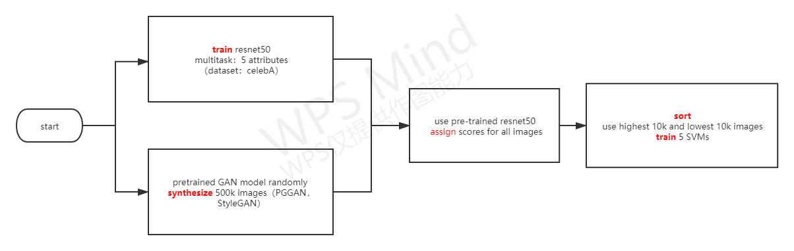

# 11.25工作总结：

1.读懂interfacegan论文。并对其代码有一个理解。

其中resnet的训练部分没有代码，这一部分可以更换为其他网络进行分类。其他部分都有代码。

2.maskGAN论文阅读过程中涉及到很多知识盲区，陆陆续续看了一些其他的论文（pix2pix，SFT-GAN，AdaIN等等）。其代码也看了一下，并没有提供training code。有pre-trained model。