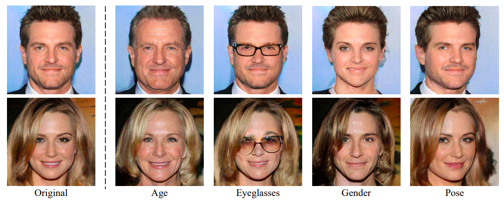
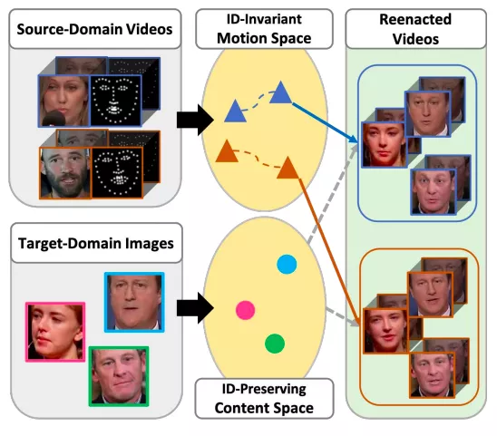

# CVPR 2020

## 人脸编辑 Facial Attribute Editing

1. Interpreting the Latent Space of GANs for Semantic Face Editing

论文 | https://arxiv.org/pdf/1907.10786.pdf

代码 | https://github.com/genforce/interfacegan

2. MaskGAN: Towards Diverse and Interactive Facial Image Manipulation

代码 | https://github.com/switchablenorms/CelebAMask-HQ

3. Cascade EF-GAN: Progressive Facial Expression Editing With Local Focuses

论文 | https://arxiv.org/pdf/2003.05905.pdf

## 人脸生成 Face Generation

1. One-Shot Domain Adaptation for Face Generation

2. Exploring Unlabeled Faces for Novel Attribute Discovery

3. Disentangled and Controllable Face Image Generation via 3D Imitative-Contrastive Learning

针对同一个人，将隐向量分解，包括姿态角，表情，光照等因素。

## 人脸重演 Face Reenactment
1. Learning Identity-Invariant Motion Representations for Cross-ID Face Reenactment

2. FReeNet: Multi-Identity Face Reenactment

代码 | https://github.com/zhangzjn/FReeNet

