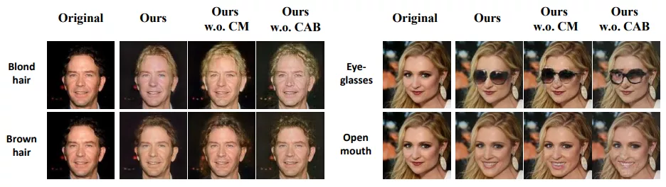
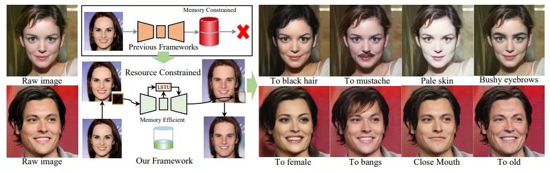
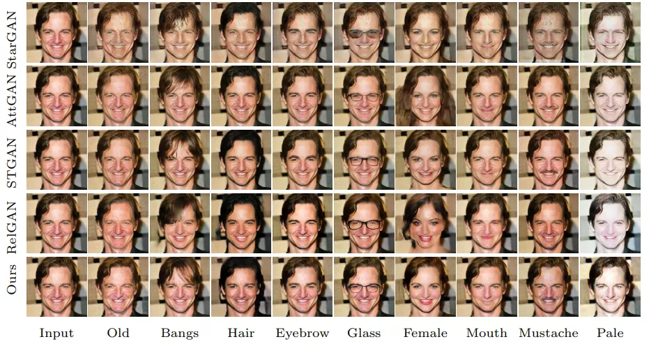
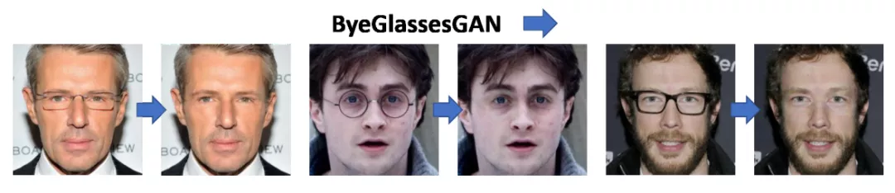

# ECCV2020

## 人脸属性编辑 Facial Attribute Editing

1. CAFE-GAN: Arbitrary Face Attribute Editing with Complementary Attention Feature

论文 | https://www.ecva.net/papers/eccv_2020/papers_ECCV/papers/123590511.pdf

2. CooGAN: A Memory-Efficient Framework for High-Resolution Facial Attribute Editing

论文 | https://www.ecva.net/papers/eccv_2020/papers_ECCV/papers/123560647.pdf

代码 | https://github.com/XHChen0528/CooGAN

3. SSCGAN: Facial Attribute Editing via Style Skip Connections

论文 | https://www.ecva.net/papers/eccv_2020/papers_ECCV/papers/123600409.pdf

4. ByeGlassesGAN: Identity Preserving Eyeglasses Removal for Face Images

论文 | https://arxiv.org/abs/2008.11042

